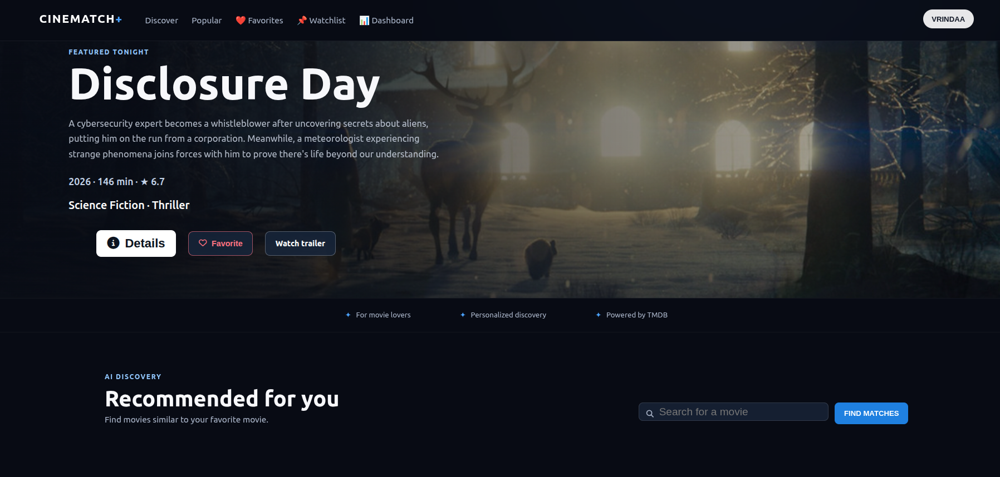
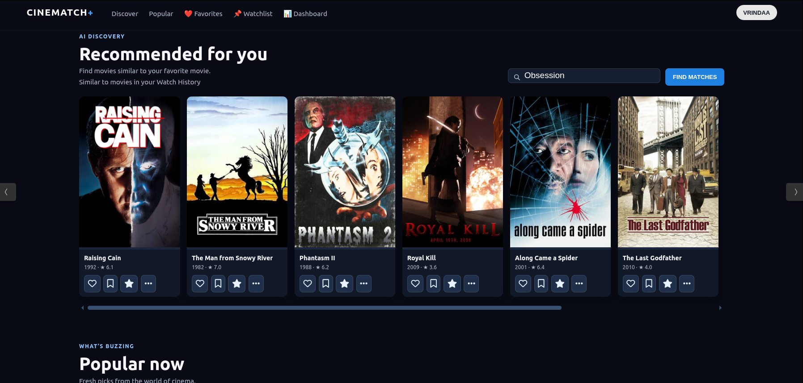

# 🎬 CineMatch+

> **AI-Powered Hybrid Movie Recommendation System** built using **Machine Learning, Flask, TMDB API, and Personalized User Profiling**.


---

## 📌 Overview

CineMatch+ is a modern AI-powered movie discovery platform that combines **Content-Based Filtering** with **TMDB's live movie database** to deliver personalized movie recommendations.

Unlike traditional recommendation systems that rely only on static datasets, CineMatch+ enriches recommendations with **real-time movie information**, **dynamic user preferences**, **favorites**, **watchlists**, **ratings**, and an interactive analytics dashboard.

---

## ✨ Features

### 🎯 Intelligent Recommendation Engine

- Content-Based Movie Recommendation
- Cosine Similarity
- Hybrid Recommendation Ranking
- Personalized Recommendations
- Recommendation Explanations
- Similarity Score

---

### 🎬 Live TMDB Integration

- Live Movie Search
- Autocomplete Search
- Movie Posters
- Backdrops
- Movie Overview
- Genres
- Runtime
- Release Date
- Ratings
- Cast Information
- Trailer Links
- Popular Movies

---

### 👤 User Personalization

- Authentication
- Favorites
- Watchlist
- Watch History
- Movie Ratings
- Dynamic Preference Learning
- Personalized Dashboard

---

### 📊 Dashboard

View your movie activity through:

- Favorites Count
- Watchlist Count
- Rating Distribution
- User Preferences
- Recently Watched
- Recommendation Statistics

---

### 🔍 Smart Search

- Real-time TMDB Autocomplete
- Debounced Search
- Keyboard Navigation
- AbortController Support
- Fast Search Experience

---

### 🎨 Modern UI

- Netflix-inspired Dark Theme
- Hero Banner
- Responsive Design
- Interactive Movie Cards
- Detailed Movie Modal
- Toast Notifications
- Smooth Animations

---

## 🧠 Machine Learning Pipeline

```
Movie Dataset
       │
       ▼
Data Cleaning
       │
       ▼
Feature Engineering
       │
       ▼
Count Vectorization
       │
       ▼
Cosine Similarity Matrix
       │
       ▼
Top Similar Movies
       │
       ▼
Hybrid Re-ranking
       │
       ▼
Personalized Recommendations
```

---

## 🏗 System Architecture

```
                User
                  │
                  ▼
          Flask Web Application
                  │
      ┌───────────┼───────────┐
      ▼                       ▼
Recommendation Engine     TMDB Service
      │                       │
      ▼                       ▼
movies.csv             TMDB REST API
Cosine Similarity
      │
      ▼
Personalized Results
```

---

## ⚙ Tech Stack

### Frontend

- HTML5
- CSS3
- JavaScript (ES6)

### Backend

- Flask
- Python

### Machine Learning

- Scikit-Learn
- Pandas
- NumPy
- Cosine Similarity
- CountVectorizer

### APIs

- TMDB API

### Tools

- Git
- GitHub
- Vercel
- VS Code

---

## 🚀 Core Features

✅ Hybrid Movie Recommendation

✅ Live TMDB Integration

✅ Smart Autocomplete Search

✅ Personalized Dashboard

✅ Favorites

✅ Watchlist

✅ Movie Ratings

✅ Watch History

✅ Recommendation Explanation

✅ Similarity Score

✅ Trailer Integration

✅ Responsive UI

✅ Authentication

---

## 📂 Project Structure

```
CineMatch-Plus
│
├── public/
│   ├── images/
│   ├── videos/
│   ├── script.js
│   └── style.css
│
├── templates/
│   └── index.html
│
├── app.py
├── main.py
├── run.py
├── tmdb_service.py
├── movies.csv
├── requirements.txt
├── README.md
├── .env.example
└── vercel.json
```

---

## ⚡ Installation

Clone the repository

```bash
git clone https://github.com/vrindaaguptaa/CineMatch-Plus.git
```

Move into the project

```bash
cd CineMatch-Plus
```

Install dependencies

```bash
pip install -r requirements.txt
```

Create a `.env` file

```env
TMDB_API_KEY=your_api_key_here
SECRET_KEY=your_secret_key
```

Run the application

```bash
python run.py
```

Open

```
http://127.0.0.1:5001
```

---

## 🔑 Environment Variables

```
TMDB_API_KEY=your_tmdb_api_key
SECRET_KEY=your_secret_key
SESSION_COOKIE_SECURE=False
```

---

## 📸 Screenshots

### Home Page



### Recommendation Page



### Dashboard


### Movie Details


---

## 📈 Future Improvements

- Collaborative Filtering
- Deep Learning Recommendations
- User Reviews
- Social Features
- Streaming Platform Integration
- Recommendation Timeline
- Genre Analytics
- Recommendation Graph Visualization

---

## 🎯 Resume Highlights

- Developed a **Hybrid Movie Recommendation System** using Machine Learning and Cosine Similarity.
- Integrated **TMDB API** for real-time movie discovery and metadata enrichment.
- Built a responsive full-stack web application using Flask and JavaScript.
- Implemented personalized recommendation logic using user interactions including favorites, watchlists, ratings, and watch history.
- Designed an interactive dashboard to visualize user preferences and recommendation insights.

---

## 📚 Learning Outcomes

This project demonstrates practical implementation of:

- Machine Learning
- Content-Based Filtering
- Cosine Similarity
- REST APIs
- Flask Backend Development
- Frontend Development
- API Integration
- User Personalization
- Recommendation Systems
- Software Architecture

---

## 🤝 Contributing

Contributions, suggestions, and feature requests are welcome.

Feel free to fork the repository and submit a pull request.

---

## 👩‍💻 Author

**Vrinda Gupta**

GitHub: https://github.com/vrindaaguptaa

---

## ⭐ Support

If you found this project useful, consider giving it a ⭐ on GitHub.
